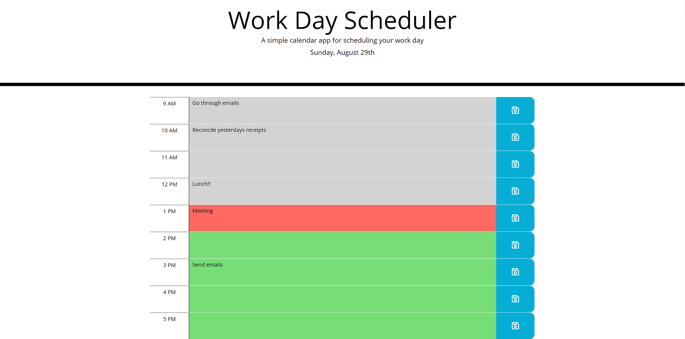

# Work Day Scheduler
- The present day is displayed at the top of the page
- The user can click in the box next to a time and enter a task
- Click the "save" icon to save the task to storage
- Delete the text in the box and click save to remove a task
- Tasks are presistent through page reload

## GitHub repsoitory and deployed application
- [Repository](https://github.com/SteveB29/work-day-scheduler)
- [Deployed application](https://steveb29.github.io/work-day-scheduler/)

## Screenshot
